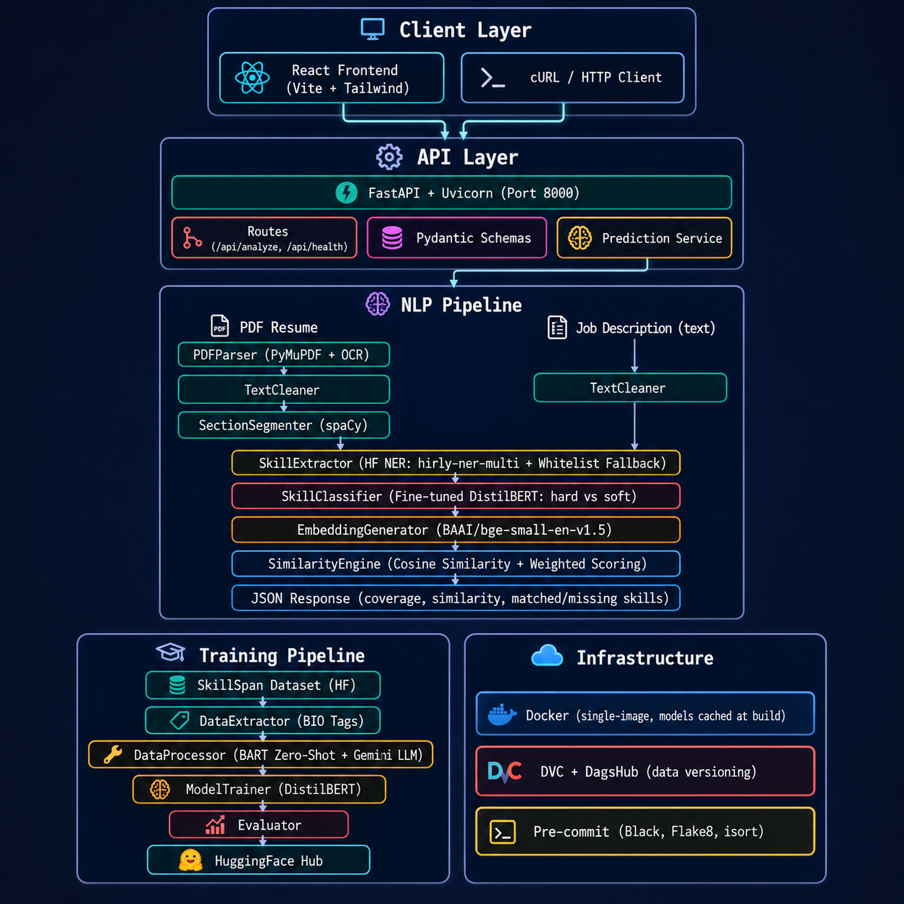

# ResumeRadar

AI-powered resume-to-job-description matching system that extracts skills, classifies them as hard or soft, computes semantic similarity, and identifies skill gaps -- delivering an ATS-style compatibility score through a REST API.

---

## Problem Statement

Recruiters and applicants lack an objective, automated way to measure how well a resume aligns with a specific job description. Manual comparison is slow, inconsistent, and fails to capture semantic equivalence between differently worded skills (e.g., "React.js" vs "React" or "CI/CD pipelines" vs "continuous integration"). Existing ATS tools rely on keyword matching and miss contextual meaning.

ResumeRadar solves this by combining transformer-based NER, a fine-tuned skill classifier, and sentence-embedding similarity to produce a quantified match score with granular skill-level feedback.

---

## Solution Overview

ResumeRadar accepts a PDF resume and a plain-text job description, then:

1. **Parses** the PDF (native text extraction with OCR fallback).
2. **Segments** the resume into canonical sections (skills, experience, projects, education, etc.) using spaCy NER and header heuristics.
3. **Extracts** skill entities from both resume and JD using a pretrained NER model (`feliponi/hirly-ner-multi`) augmented by a curated hard-skills whitelist.
4. **Classifies** each extracted skill as hard or soft using a fine-tuned DistilBERT classifier (`anujot/resumeradar-skill-classifier`).
5. **Encodes** skill lists into dense vector embeddings via `BAAI/bge-small-en-v1.5`.
6. **Computes** cosine similarity between resume and JD skill embeddings, producing matched skills, missing skills, coverage ratio, and a weighted final score.
7. **Returns** structured JSON through a FastAPI endpoint.

---

## Architecture



```
Client (React Frontend / cURL)
        |
        v
  FastAPI Backend (uvicorn)
        |
        v
  NLP Pipeline (orchestrator)
    |         |          |           |            |
    v         v          v           v            v
 PDFParser  Segmenter  Extractor  Classifier  SimilarityEngine
 (PyMuPDF)  (spaCy)    (HF NER)  (DistilBERT) (bge-small-en)
        |
        v
  JSON Response (coverage, similarity, matched/missing skills)
```

**Key components:**

| Layer | Component | Responsibility |
|---|---|---|
| API | FastAPI + Uvicorn | REST endpoint, request validation, file upload handling |
| Parsing | `PDFParser` | PDF text extraction (native + OCR fallback via PyMuPDF) |
| Parsing | `TextCleaner` | Normalize bullets, remove special chars, collapse whitespace |
| Segmentation | `SectionSegmenter` | Split resume into sections (skills, experience, projects, etc.) |
| Entity Extraction | `SkillExtractor` | Transformer NER + whitelist keyword fallback |
| Classification | `SkillClassifier` | Fine-tuned DistilBERT binary classifier (hard vs soft) |
| Embeddings | `EmbeddingGenerator` | Sentence-level embeddings via `bge-small-en-v1.5` |
| Similarity | `SimilarityEngine` | Cosine similarity matrix, threshold-based matching, weighted scoring |
| Frontend | React + Vite | Landing page, upload/analyze page, results page |
| Data Versioning | DVC | Dataset tracking with DagsHub remote |
| Containerization | Docker | Single-image deployment with model caching at build time |

---

## Tech Stack

| Category | Technologies |
|---|---|
| Backend Framework | FastAPI, Uvicorn |
| Language | Python 3.11 |
| NLP / ML | Transformers, spaCy, Sentence-Transformers, PyTorch |
| PDF Processing | PyMuPDF |
| Embeddings | BAAI/bge-small-en-v1.5 (SentenceTransformer) |
| NER Model | feliponi/hirly-ner-multi (HuggingFace) |
| Skill Classifier | anujot/resumeradar-skill-classifier (fine-tuned DistilBERT) |
| LLM (Training Data) | Google Gemini (gemini-2.5-flash-lite) |
| Zero-Shot (Training) | facebook/bart-large-mnli |
| Frontend | React 19, Vite, Tailwind CSS, Framer Motion, Axios |
| Data Versioning | DVC (DagsHub remote) |
| Containerization | Docker |
| Code Quality | pre-commit, Black, Flake8, isort |
| Configuration | Pydantic Settings, python-dotenv |

---

## Models / NLP Pipeline

### 1. Skill Extraction (NER)

- **Model**: `feliponi/hirly-ner-multi` (HuggingFace token classification)
- **Task**: Named Entity Recognition for skill entities in resume and JD text.
- **Augmentation**: Curated whitelist of ~300 hard skills used as keyword fallback to catch skills missed by NER.
- **Filtering**: Blacklist of ~390 noise terms (role words, resume filler, vague buzzwords) to suppress false positives.
- **Confidence threshold**: 0.75

### 2. Skill Classification (Hard vs Soft)

- **Model**: `anujot/resumeradar-skill-classifier` (DistilBERT, fine-tuned for sequence classification)
- **Architecture**: `DistilBertForSequenceClassification`, 6 layers, 768-dim, 12 heads
- **Labels**: `hard` (class 0), `soft` (class 1)
- **Training data**: SkillSpan dataset (`jjzha/skillspan`) processed through a multi-stage pipeline:
  1. BIO-tagged skill spans extracted from token-level annotations.
  2. Zero-shot classification (`bart-large-mnli`) for initial labeling.
  3. LLM fallback (Gemini) for low-confidence samples.
- **Training**: Weighted cross-entropy loss with class balancing, early stopping (patience=2), 5 epochs, batch size 64, learning rate 3e-5.
- **Decision threshold**: 0.5 (loaded from `threshold.json`).

### 3. Embedding Generation

- **Model**: `BAAI/bge-small-en-v1.5` (SentenceTransformer)
- **Output**: 384-dim normalized embeddings per skill.
- **Purpose**: Dense vector representations for cosine similarity computation.

### 4. Similarity Scoring

- **Method**: Cosine similarity matrix between resume and JD skill embeddings.
- **Match threshold**: 0.65
- **Deduplication**: One-to-one matching (highest score wins, duplicates moved to missing).
- **Final score formula**: `0.7 * hard_similarity + 0.2 * coverage + 0.1 * soft_similarity`

### Inference Pipeline Flow

```
PDF Resume ──> PDFParser ──> TextCleaner ──> SectionSegmenter ──> SkillExtractor ──> SkillClassifier ──> EmbeddingGenerator ──┐
                                                                                                                              ├──> SimilarityEngine ──> JSON
JD Text ──────────────────> TextCleaner ──────────────────────> SkillExtractor ──> SkillClassifier ──> EmbeddingGenerator ──┘
```

---

## Features

- PDF resume parsing with native text extraction and Tesseract OCR fallback
- Automatic resume section segmentation (summary, skills, experience, projects, education, certifications, achievements)
- Contact information extraction (name via spaCy NER, email, phone via regex)
- Transformer-based skill entity extraction with curated whitelist augmentation
- Binary skill classification (hard vs soft) using fine-tuned DistilBERT
- Semantic skill matching via dense embeddings and cosine similarity
- Skill gap analysis: matched skills with scores + missing skills report
- Weighted final compatibility score (hard similarity, coverage, soft similarity)
- Structured JSON API response with per-skill match details
- File size validation (configurable, default 5 MB)
- Health check endpoint
- React frontend with landing page, upload/analyze page, and results visualization
- Docker single-image deployment with all models cached at build time
- DVC-tracked datasets with DagsHub remote
- Configurable thresholds and weights via dataclass configs
- Structured file-based logging with timestamps
- Pre-commit hooks (Black, Flake8, isort)

---

## Evaluation Metrics

Skill classifier evaluated on the held-out test split (984 samples):

| Metric | Hard Skills (class 0) | Soft Skills (class 1) | Weighted Avg |
|---|---|---|---|
| Precision | 0.885 | 0.712 | 0.828 |
| Recall | 0.843 | 0.780 | 0.822 |
| F1-Score | 0.864 | 0.745 | 0.824 |

**Overall accuracy**: 82.2%

---

## Setup and Installation

### Prerequisites

- Python 3.11+
- Docker (for containerized deployment)
- A Gemini API key (only required for training pipeline)

### Option 1: Docker (Recommended)

```bash
git clone https://github.com/anujott-codes/ResumeRadar.git
cd ResumeRadar

docker build -t resumeradar .

docker run -p 8000:8000 --env-file .env resumeradar
```

All models are downloaded and cached during the Docker build. No additional setup required.

### Option 2: Local Setup

```bash
git clone https://github.com/anujott-codes/ResumeRadar.git
cd ResumeRadar

python -m venv .venv
source .venv/bin/activate

pip install -r requirements.txt
python -m spacy download en_core_web_sm
```

Create a `.env` file:

```env
GEMINI_API_KEY=your_api_key_here
```

Start the server:

```bash
uvicorn src.backend.main:app --host 0.0.0.0 --port 8000
```

### Frontend Setup

```bash
cd src/frontend
npm install
npm run dev
```

---

## Usage

### API Endpoints

| Method | Endpoint | Description |
|---|---|---|
| `GET` | `/` | Root welcome message |
| `GET` | `/api/health` | Health check |
| `POST` | `/api/analyze` | Analyze resume against job description |

### Analyze Endpoint

**Request** (`multipart/form-data`):

| Field | Type | Description |
|---|---|---|
| `resume` | File (PDF) | Resume PDF file (max 5 MB) |
| `jd_text` | String | Job description text |

**Example (cURL):**

```bash
curl -X POST http://localhost:8000/api/analyze \
  -F "resume=@resume.pdf" \
  -F "jd_text=We are looking for a Python developer with experience in FastAPI, Docker, machine learning, and NLP. Strong communication and teamwork skills required."
```

**Response:**

```json
{
  "coverage": 0.667,
  "hard_similarity": 0.743,
  "soft_similarity": 0.612,
  "final_similarity": 0.714,
  "hard_skills": {
    "matched": [
      {"jd_skill": "python", "matched_with": "python", "score": 1.0},
      {"jd_skill": "fastapi", "matched_with": "flask", "score": 0.782},
      {"jd_skill": "docker", "matched_with": "docker", "score": 1.0}
    ],
    "missing": [
      {"jd_skill": "nlp", "score": 0.421}
    ]
  },
  "soft_skills": {
    "matched": [
      {"jd_skill": "communication", "matched_with": "communication", "score": 1.0}
    ],
    "missing": [
      {"jd_skill": "teamwork", "score": 0.34}
    ]
  }
}
```

### Interactive API Docs

Once the server is running, visit:

- Swagger UI: `http://localhost:8000/docs`
- ReDoc: `http://localhost:8000/redoc`

---

## Testing

### Manual API Test

```bash
curl -X POST http://localhost:8000/api/analyze \
  -F "resume=ADD_SAMPLE_RESUME_HERE" \
  -F "jd_text=ADD_SAMPLE_JD_HERE"
```

### Health Check

```bash
curl http://localhost:8000/api/health
# Expected: {"status": "ok"}
```

---

## Project Structure

```
ResumeRadar/
├── src/
│   ├── backend/
│   │   ├── main.py                    # FastAPI app factory
│   │   ├── core/
│   │   │   └── config.py              # App settings (Pydantic)
│   │   ├── routes/
│   │   │   ├── analyze_route.py       # POST /api/analyze
│   │   │   ├── health_route.py        # GET /api/health
│   │   │   └── root_router.py         # GET /
│   │   ├── schemas/
│   │   │   ├── request_schema.py      # Request validation
│   │   │   └── response_schema.py     # Response models
│   │   └── services/
│   │       └── prediction_service.py  # Orchestrates NLP pipeline
│   ├── nlp/
│   │   ├── pipeline/
│   │   │   └── nlp_pipeline.py        # End-to-end NLP orchestrator
│   │   ├── parsing/
│   │   │   ├── pdf_parser.py          # PDF text extraction
│   │   │   └── text_cleaner.py        # Text normalization
│   │   ├── segmentation/
│   │   │   └── section_segmenter.py   # Resume section splitter
│   │   ├── entity_extraction/
│   │   │   └── skill_extractor.py     # NER-based skill extraction
│   │   ├── classification/
│   │   │   └── skill_classifier.py    # Hard/soft skill classifier
│   │   ├── embeddings/
│   │   │   └── embedding_generator.py # Sentence embeddings
│   │   ├── similarity/
│   │   │   └── similarity_engine.py   # Cosine similarity + scoring
│   │   ├── config/                    # All NLP configurations
│   │   └── schema/                    # NLP data schemas
│   ├── frontend/                      # React + Vite frontend
│   ├── exception/                     # Custom exceptions
│   └── logging/                       # Structured logging
├── training/
│   ├── pipeline/
│   │   └── training_pipeline.py       # End-to-end training orchestrator
│   ├── components/
│   │   ├── data_loader.py             # Load SkillSpan dataset
│   │   ├── data_extractor.py          # Extract skill spans from BIO tags
│   │   ├── data_processor.py          # Zero-shot + LLM labeling
│   │   ├── model_trainer.py           # Fine-tune DistilBERT
│   │   └── evaluator.py              # Evaluate + save metrics
│   └── configs/                       # Training configurations
├── data/                              # DVC-tracked datasets (raw, staged, processed)
├── artifacts/
│   ├── model/                         # Trained model weights + config
│   └── metrics/                       # Evaluation metrics JSON
├── logs/                              # Timestamped log files
├── Dockerfile                         # Production container
├── requirements.txt                   # Python dependencies
├── requirements-dev.txt               # Dev dependencies
├── pyproject.toml                     # Project metadata
├── .pre-commit-config.yaml            # Code quality hooks
└── .dvc/                              # DVC configuration (DagsHub remote)
```

---

## Demo

[](https://youtu.be/iT_0WsJy2C0)

---

## Future Improvements

- Add batch processing for multiple resumes against a single JD
- Implement resume ranking/leaderboard for recruiters
- Add support for DOCX and plain-text resume uploads
- Replace cosine similarity with cross-encoder reranking for higher matching accuracy
- Add caching layer (Redis) for repeated JD processing
- Implement CI/CD pipeline with automated testing and Docker registry push
- Deploy on cloud (AWS ECS / GCP Cloud Run) with auto-scaling
- Add user authentication and job posting management
- Expand evaluation with A/B testing against recruiter ground truth
- Fine-tune NER model on domain-specific resume/JD data
- Add explainability layer for match score breakdown

---

## Author

**Anujot Singh**
